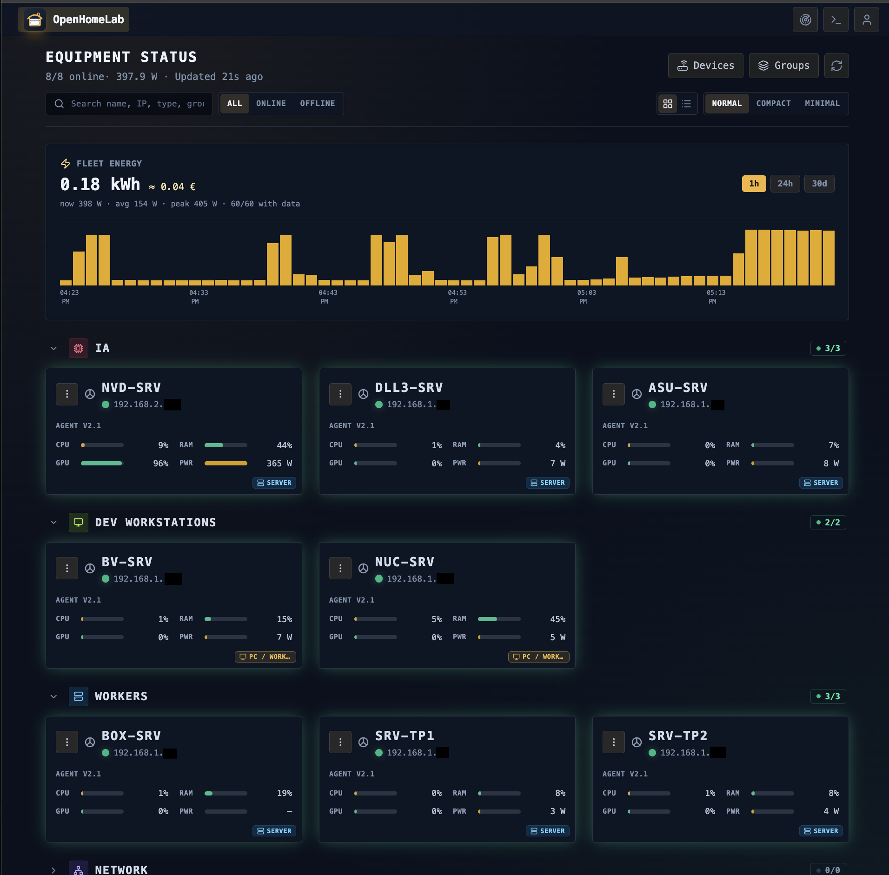
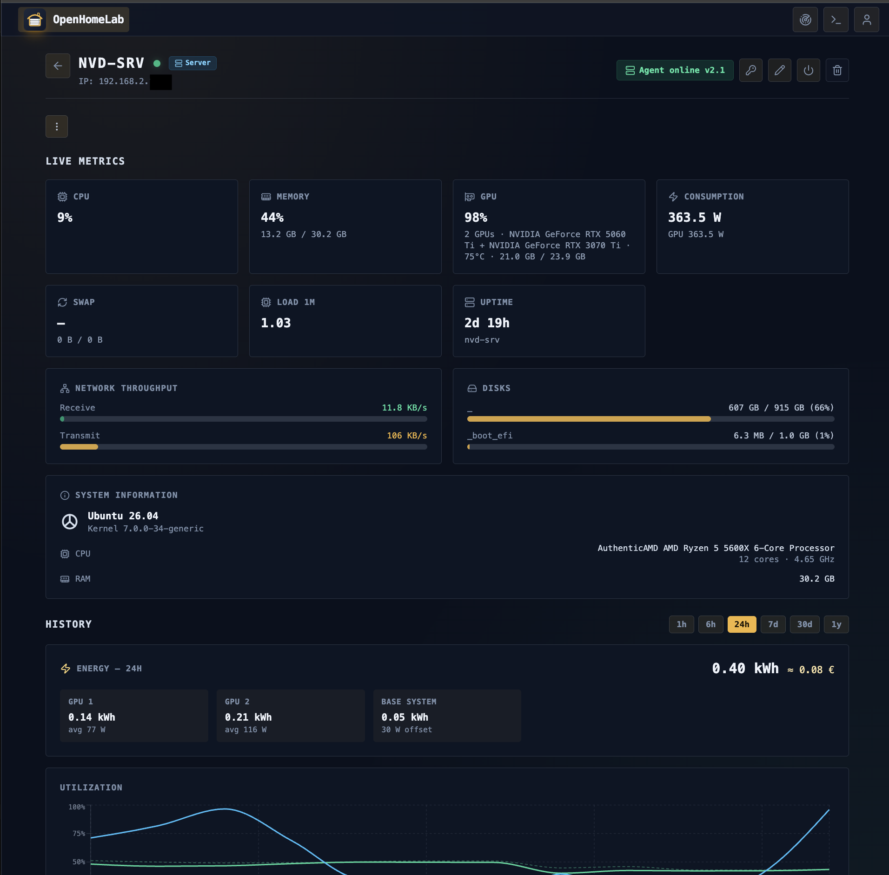
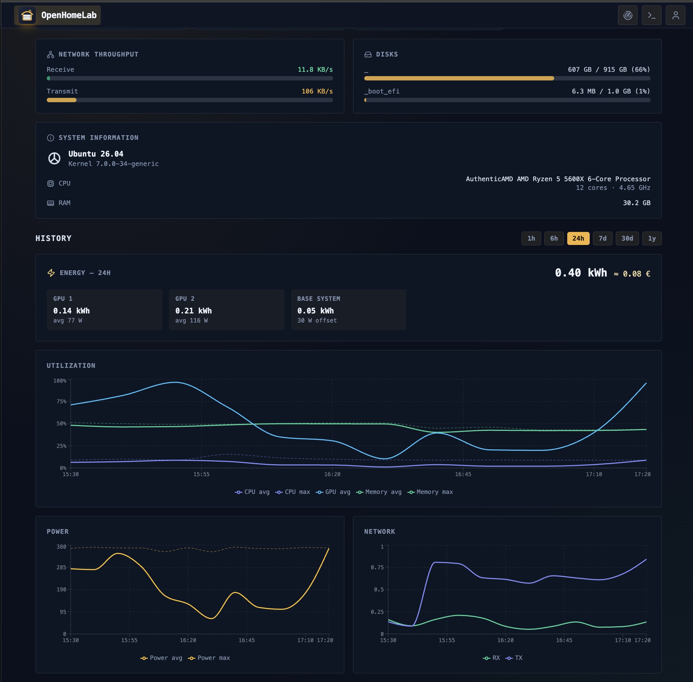
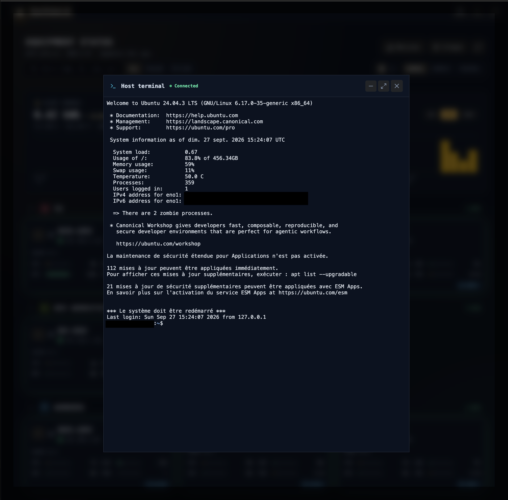

<div align="center">


# OpenHomeLab

Self-hosted network device controller. Monitor your equipment with live ping status, wake machines with Wake-on-LAN, reboot or shut them down remotely, stream metrics and energy usage in real time, open an SSH terminal from the browser — all behind a single master password.

</div>

## Contents

- [Features](#features)
- [Screenshots](#screenshots)
- [Architecture](#architecture)
- [Getting started (local development)](#getting-started-local-development)
- [Docker](#docker)
- [Environment variables](#environment-variables)
- [Agent & onboarding](#agent--onboarding)
- [Network scanner](#network-scanner)
- [Web SSH terminal](#web-ssh-terminal)
- [Device groups](#device-groups)
- [Metrics, energy & cost](#metrics-energy--cost)
- [Power actions](#power-actions)
- [API overview](#api-overview)
- [Hibernation & the swap preflight](#hibernation--the-swap-preflight)
- [Contributing](#contributing)
- [Scripts](#scripts)

## Features

- **Dashboard** — real-time online/offline status for every device, grid or list view with selectable card size, per-device ping test, in-flight action log with failure output
- **Network scanner** — scan an IP range (auto-detected default) for live hosts: ping + ARP enrichment (hostname, MAC, vendor), open-port discovery, and one-click "add as device"
- **Wake-on-LAN** — sends magic packets to the local broadcast addresses (and an optional per-device broadcast address); available for offline devices of any type
- **Remote reboot / shutdown / hibernate / agent update** — hybrid delivery: queued to the agent when the machine is online, SSH fallback via the assigned profile otherwise; confirmation step in the UI; failures (e.g. insufficient swap for hibernate) are surfaced on the dashboard
- **Web SSH terminal** — an xterm.js terminal in the browser connects over WebSocket (`/api/terminal/ws`) using the device's assigned SSH profile or any profile chosen ad hoc, with live resize support
- **Push agent & metrics** — a lightweight shell agent installs on target machines (`curl … | sh`), collects CPU, load, memory, swap, disks, network throughput, GPU utilization and power draw every 30s (plus the OS name) and pushes them to the server; live gauges plus per-device history (7 days raw, hourly/daily aggregates kept forever). The agent reports its version with each push — devices running an older version are marked *outdated* in the UI, and agents can be updated or reinstalled remotely from the dashboard
- **Energy & cost** — kWh consumption per device and for the whole fleet, with a configurable base-power offset (`base_power_w`) for idle draw; set `cost_per_kwh` and a currency to see costs. Gaps wider than 150s (agent offline) contribute zero energy
- **Device groups** — organize devices into named groups with an icon and a color; reorder devices within or across groups by drag & drop
- **Zero-config onboarding** — generate a one-time claim link in the UI, run `curl … | sh` on the target machine, and the first agent push registers the device automatically (name from hostname, IP, OS)
- **SSH profiles** — password or private-key auth; credentials are encrypted at rest (AES-256-GCM) and never returned by the API
- **External API** — a dedicated public surface for outside systems with scoped `ncapi-*` tokens (per-device scoping, per-operation permissions, usage logs)
- **Data import/export** — JSON export of devices, profiles and groups; idempotent upsert import that re-encrypts plaintext credentials
- **Security** — master-password login (bcrypt), 24h JWT sessions, login rate limiting, change-password flow

## Screenshots

**Dashboard** — fleet status at a glance: online/offline counts, total fleet power and energy (kWh with estimated cost), device cards grouped by group with live CPU/RAM/GPU utilization and power draw per device.



**Device detail — live metrics** — real-time gauges for CPU, memory, GPU and power consumption, plus swap, load, uptime, network throughput, disk usage and full system information (OS, kernel, CPU model, RAM), with the agent status badge up top.



**Device detail — history** — energy consumption broken down per GPU and base system for the selected range, alongside utilization, power and network charts across selectable ranges from 1h to 1y.



**Web SSH terminal** — a full xterm.js session to a host profile straight from the browser, streamed over WebSocket with live resize support.



## Architecture

```
   browser                                          target machines
┌───────────────────────┐                        ┌──────────────────────────┐
│      React SPA        │       REST             │                          │
│                       │ ◄────────────────►     │        pc · server       │
│  dashboard · scanner  │  /api/*                │       · nas · router     │
│  groups · terminal    │                        │         · tv · iot       │
│  (xterm.js)           │      WebSocket         └───────────▲──────────────┘
└───────────┬───────────┘   /api/terminal/ws                 │
            ▼                                                │
┌───────────────────────────────────┐   WOL magic packets    │
│          Express server           │  (UDP broadcast)       │
│                                   ├────────────────────────┤
│        SQLite (single file)       │   SSH: power commands, │
│                                   │   terminal, reinstall  │
└───────────────────▲───────────────┘ ◄──────────────────────┘
                    │
                    │ every 30s: metrics + action results
                    │ install: curl …/api/agent/install | sh
          ┌─────────┴──────────┐
          │    agent script    │
          └────────────────────┘
```

## Getting started (local development)

Requires Node.js >= 20.

```bash
npm install
npm run dev               # starts API + Vite dev server on :3000
```

Environment variables (`PORT`, `DB_PATH`, `JWT_SECRET`, `APP_ENCRYPTION_KEY`) must be exported in your shell for `npm run dev` — `.env` is only read by docker compose.

The first request to `GET /api/setup/status` reports `isSetup: false`; log in with the setup form to create your master password.

## Docker

### Production (pre-built image)

```bash
cp .env.example .env      # set JWT_SECRET (and optionally APP_ENCRYPTION_KEY, OPENHOMELAB_VERSION)
docker compose pull && docker compose up -d
```

`docker-compose.yml` pulls the pre-built `ghcr.io/mossaab/openhomelab:${OPENHOMELAB_VERSION:-latest}` image. Both values are overridable in `.env` (`OPENHOMELAB_IMAGE`, `OPENHOMELAB_VERSION`). To upgrade, pin `OPENHOMELAB_VERSION=vX.Y.Z` in `.env`, then run `docker compose pull && docker compose up -d`.

### Local development (build from source)

```bash
cp .env.example .env      # optional
docker compose -f docker-compose.dev.yml up -d --build
```

The container uses host networking so Wake-on-LAN broadcast packets reach the LAN, and runs with `NET_RAW` (ICMP ping) and `NET_BROADCAST` (WOL UDP broadcast send) capabilities as a non-root user (`node`, uid 1000). The database is persisted in the `sqlite_data` volume — both compose files use the same named volume (`openhomelab_sqlite_data`), so switching dev ↔ prod needs no data migration.

> **Existing installations**: the database lives in the `openhomelab_sqlite_data` volume. If you upgraded from an older version, copy your database from the old volume before the first `docker compose up`, or the app starts with an empty database:
>
> ```bash
> docker run --rm -v <old-volume>:/old -v openhomelab_sqlite_data:/new alpine sh -c 'cp /old/database.sqlite /new/database.sqlite'
> ```
>
> Older image versions ran as root, so an existing volume's files are owned by root and the non-root container cannot write them. Fix ownership (no data loss) before starting:
>
> ```bash
> docker run --rm -v openhomelab_sqlite_data:/data alpine chown -R 1000:1000 /data
> ```
>
> Machines that still run a legacy agent should be cleaned with `scripts/remove-legacy-agents.sh` (run as root on the machine).

The footer displays the running version, taken from the `version` field of `package.json` at build time. Release images have it baked in from the tag by the CI workflow (see «Releasing»); for local builds you can override it per build with the `APP_VERSION` env var (e.g. `APP_VERSION=$(git describe --tags) docker compose -f docker-compose.dev.yml up --build -d`) to match the release tag exactly.

## Releasing

Releases are cut from git tags. The version lives in `package.json`; bump it with npm, push, and the `release` workflow does the rest:

```bash
npm version patch        # or minor / major — updates package.json, commits, creates tag vX.Y.Z
git push && git push --tags
```

On the `v*` tag the workflow verifies the tag matches the `package.json` version, runs lint + tests, publishes a GitHub Release with source archives (`.tar.gz`/`.zip`) and auto-generated notes, and builds + pushes the Docker image to `ghcr.io/mossaab/openhomelab` under tags `vX.Y.Z` and `latest` (the image digest is noted in the release notes).

Prerequisite: repository settings → Actions → Workflow permissions must grant **Read and write** for `packages` (so `GITHUB_TOKEN` can push to GHCR) and for `contents` (to create the release).

## Environment variables

| Variable | Required | Description |
| --- | --- | --- |
| `PORT` | no (default `3000`) | HTTP listen port |
| `DB_PATH` | no (default `./database.sqlite`) | SQLite database file location |
| `JWT_SECRET` | **yes in production** | Secret used to sign session tokens. The server refuses to start in production if it is missing or the default value |
| `APP_ENCRYPTION_KEY` | no | 64-char hex key (AES-256) for encrypting stored SSH credentials. If omitted, a random key is generated once and stored in the database. **Never change it after first use** — stored credentials would become undecryptable |

## Agent & onboarding

The agent is a single shell script served by the server:

```bash
curl -fsS https://<server>/api/agent/install | sh -s -- https://<server> <agent_token>
```

Two ways to distribute it:

1. **Per-device token** — open a device, generate its agent token (`POST /api/devices/:id/agent/token`, returned once and stored as a hash), then run the install command on the machine. The UI shows a ready-to-paste command. Agents can later be updated in bulk (`POST /api/devices/agents/update`) or reinstalled over SSH by the server itself (`POST /api/devices/:id/agent/reinstall`).
2. **Claim link (zero-config)** — for machines you don't manage yet, create a claim: `POST /api/devices/claim` returns a one-time token (15-minute TTL) plus the install path — the UI turns that into a ready-to-paste `curl … | sh` command. Run it on the machine; when the agent's first metrics push arrives, the server registers a new device from the snapshot (hostname, IP, OS) and consumes the claim.

```
 UI "onboard" ──► POST /api/devices/claim ──► one-time token (15-min TTL)
                                                      │
   target machine: curl -fsS <server>/api/agent/install | sh -s -- URL TOKEN
                                                      │
                                            first metrics push
                                                      ▼
                        device auto-registered (hostname, IP, OS) — claim consumed
```

## Network scanner

`POST /api/scan` starts a background job over an IP range (`startIp`, `endIp`, optional port list of 1–100 ports). While it runs you can poll progress with `GET /api/scan/:id` or stop it with `POST /api/scan/:id/cancel`. Live hosts are enriched with hostname, MAC and vendor (ARP table) plus open ports; hosts that are already managed in the app are flagged as such.

```
 POST /api/scan {startIp, endIp, ports?} ──► scanId    (background job)
                                             │
                          poll GET /api/scan/:id  ▼
                        running ────────────────────► done | cancelled | failed
                        hosts: ip · online · hostname
                              mac · vendor · ports[]
                                             │
                                             ▼
                               add discovered host as device
```

`GET /api/scan/default-range` returns the detected local LAN range to pre-fill the form.

## Web SSH terminal

The browser terminal is a WebSocket at `/api/terminal/ws?target=device&deviceId=<id>&token=<jwt>` (or `target=host&profileId=<id>` for an ad-hoc connection through any profile). The server opens the SSH session with ssh2 using the device's assigned profile credentials — decrypted only in memory, never exposed to the client — and streams it into xterm.js. Terminal resize is forwarded (`{ type: "resize", cols, rows }`). Devices can disable the terminal per-device (`disable_terminal`).

## Device groups

Devices can be sorted into named groups (icon + color) shown as sections on the dashboard. `POST /api/groups` creates one, `POST /api/groups/reorder` reorders all of them (full id list), and `PUT /api/devices/:id/move` moves a device to a position inside a group (`group_id` = `null` for ungrouped). Deleting a group detaches its devices.

## Metrics, energy & cost

The agent pushes a snapshot every 30s (interval configurable in settings). Each push upserts the live row and appends a raw point; a 5-minute job rolls raw data into hourly/daily aggregates (raw is pruned after 7 days) and settles stale actions.

```
 agent (every 30 s)                server                            5-min job
┌──────────────────────┐          ┌───────────────────┐             ┌───────────────────┐
│ cpu · load · memory  │   POST   │  metrics_live     │  roll-up    │  metrics_hourly   │
│ swap · disks · net   ├────────►│  (last snapshot)  ├────────────►│  metrics_daily    │
│ gpu · power (W) · os │ /api/    └────────┬──────────┘             │  (kept forever)   │
└──────────────────────┘  agent/stats      │                        └─────────┬─────────┘
                                           ▼                                  │
                                ┌───────────────────┐                         ▼
                                │     metrics_raw   │               computeEnergyKwh()
                                │ (every push,      │                → kWh · cost
                                │  pruned at 7 d)   │
                                └───────────────────┘
```

Per-device energy (`GET /api/devices/:id/stats/energy?range=…`) splits consumption into CPU/GPU components plus the **base-power offset**: the device's `base_power_w` (idle draw you set once) is applied for every second the agent is online. Fleet totals use `GET /api/devices/stats/energy?range=`, and the fleet power curve in watts uses `GET /api/devices/stats/power?range=`. Ranges: `1h | 6h | 24h | 7d | 30d | 1y` for the energy endpoints, `1h | 24h | 30d` for the power curve. With `cost_per_kwh` set, every response includes the monetary cost in the configured currency.

## Power actions

`POST /api/devices/:id/command` accepts `reboot`, `shutdown`, `hibernate` and `update`. Delivery is hybrid: if the device's agent pushed metrics within the staleness window (90s at the default 30s interval), the action is queued for the agent; otherwise it runs the profile's command over SSH. The external machine API (`/machines/:id/restart`, `/stop`) uses the same path.

```
 UI /api/devices/:id/command        API /api/machines/:id/restart
                    │
                    ▼
        ┌─────────────────────┐
        │ agent online (<90s)?│
        └────┬───────────┬────┘
           yes          no
             │           │
             ▼           ▼
  device_actions queue  SSH via the assigned profile
  pending               (reboot_command / shutdown_command)
    │
    ▼
 acknowledged
    │
    ▼
 started ──► done       agent reports via POST /api/agent/action-result
    └──────► failed     stale actions are settled after 10 min (agent offline)
```

Action state is visible live on the dashboard (`GET /api/devices/actions` returns in-flight actions from the last 10 minutes, failures include the agent output). The `update` action makes the agent re-download itself from `GET /api/agent/script` and restart.

## API overview

All routes are under `/api`. Three auth models coexist: JWT bearer tokens (24h sessions from setup/login) protect the UI and management routes; per-device `tk-…` agent tokens authenticate the `/agent/*` endpoints; scoped `ncapi-*` tokens protect the public machine surface used by external automation.

Full route reference: [docs/API.md](docs/API.md). External machine API (`/machines/*`): [docs/MACHINE_API.md](docs/MACHINE_API.md).

## Hibernation & the swap preflight

The agent's `hibernate` action checks that the target machine has enough swap to hold **currently used RAM** (`MemTotal − MemAvailable`, not total RAM) before invoking `systemctl hibernate`. If swap covers the used memory, it hibernates directly. If not (common on servers with large RAM and small/missing swap), the agent attempts an idempotent auto-repair first:

1. sizes a swap file to the used RAM, rounded up to a power-of-two GB,
2. formats and activates it (`mkswap` / `swapon`),
3. persists it in `/etc/fstab`,
4. adds `resume=<swapfile>` to GRUB and regenerates the bootloader,

then proceeds with the hibernate — the dashboard shows a “repaired swap …” notice on success. The target paths are overridable in the agent environment (`SWAP_FILE`, `FSTAB`, `GRUB_DEFAULT`).

If the auto-repair cannot complete (e.g. no free space), the action fails fast with the exact figures — how much RAM is in use vs how much swap exists — plus a hint pointing at the helper script, and the reason is surfaced on the dashboard: no half-suspended NVIDIA drivers, no bootable-but-broken image.

For machines without an agent (or to set things up manually), run the helper from this repo as root on that machine:

```bash
sh scripts/fix-hibernate.sh
```

It is idempotent and distro-agnostic: sizes a `/swap.img` (power-of-two GB ≥ RAM), persists it in `/etc/fstab`, sets `resume=/swap.img` in GRUB and regenerates the bootloader, then prints a verification summary (swap total, kernel cmdline, NVIDIA suspend state). Reboot the machine when convenient to pick it up.

## Contributing

Contributions are welcome — see [CONTRIBUTING.md](CONTRIBUTING.md) for the development setup, project conventions, and pull-request requirements (lint + tests must pass). Please also read the [Code of Conduct](CODE_OF_CONDUCT.md) before participating.

## Scripts

| Command | Description |
| --- | --- |
| `npm run dev` | Run API + Vite in development mode |
| `npm run build` | Build the frontend and bundle the server into `dist/` |
| `npm start` | Run the production build |
| `npm run lint` | ESLint + TypeScript type check |
| `npm test` | Run the API test suite (Vitest + Supertest) |
| `npm run render-icons` | Regenerate the committed PNG icons from `logo.svg` — requires `npx playwright install chromium` once; only needed after a logo change |
